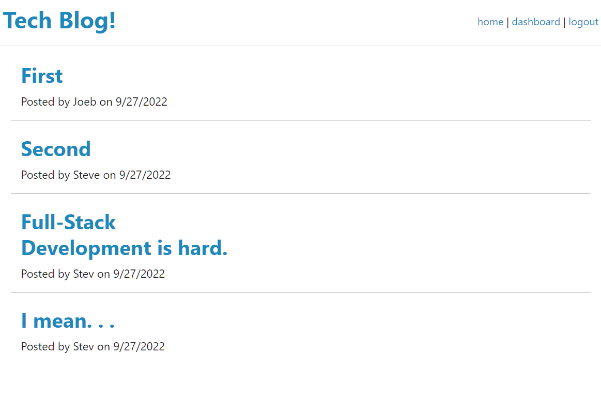
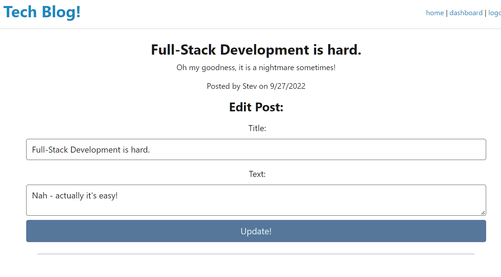

  # Tech-Blog

  ## Table of Contents
  * [Description](#description)
  * [Installation](#installation)
  * [Usage](#usage)
  * [Questions](#questions)

  ## Description

  Post articles, comment on other users' posts, and have a grand ole time! This tech-blog is interactive and has working user log-in functionality.
    
  ## Installation

  Follow the below steps to install the program:

    npm i

  ## Usage
  
  Try out the launched application: [HERE!](https://tech-blog-stevengoldbergm.herokuapp.com/)

  To use the Tech-Blog, you need an account! 
  
  Sign up by clicking the login link in the top-right corner of the page! Once you have an account, you can reach the Dashboard from the navbar, which is where you can submit, review, and delete your posts!

    NOTE: Some functionality is not yet available:
    - Post comments on individual posts
    - Comment list on the dashboard
    - Post updates through the edit page
    - User varification for edit page 

  ## Questions

  For more information, feel free to contact me:

  GitHub: [github.com/stevengoldbergm](https://github.com/stevengoldbergm)
  